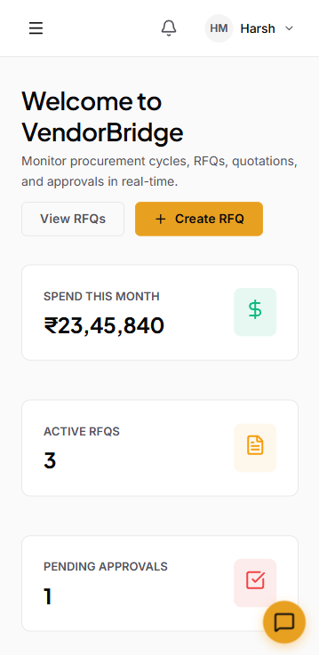
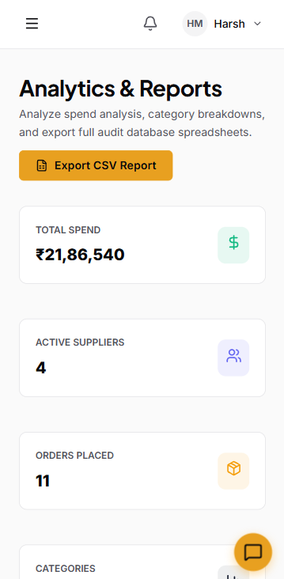
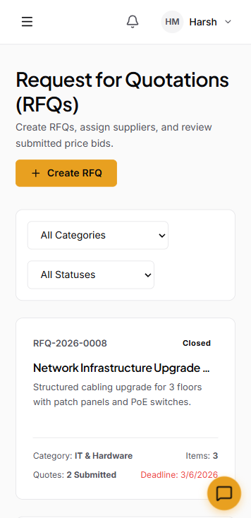

<div align="center">

# ⚡ VendorBridge ERP

### Built by **Team Clickjack** — for the ones who ship, not just talk.

[](https://odoo-vendorbridge.onrender.com)
[](https://github.com/Notanormaldev/Odoo_VendorBridge)

> A full-stack, production-grade **Procurement & Vendor Management ERP** —  
> AI-powered · Real-time · Multi-role · Fully responsive

</div>

---

## 📸 Preview

| Dashboard | RFQs |
|-----------|------|
|  |  |

| Invoices | Activity Logs |
|----------|---------------|
|  |  |

### 📱 Mobile — Pixel Perfect

| Mobile Dashboard | Mobile Reports | Mobile RFQs |
|-----------------|----------------|-------------|
|  |  |  |

---


## 🔑 Test Credentials — Jump Right In

> No signup needed. Use these accounts to explore every role instantly.

| Role | Email | Password |
|------|-------|----------|
| 👑 Admin | test_admin@vendorbridge.com | TestPass123 |
| 🧑‍💼 Manager | test_manager@vendorbridge.com | TestPass123 |
| 📋 Officer | test_officer@vendorbridge.com | TestPass123 |
| 🏢 Vendor | test_vendor1@vendorbridge.com | TestPass123 |

## 🧠 What is VendorBridge?

VendorBridge digitizes the **entire B2B procurement lifecycle** — from RFQ creation to vendor bidding, multi-level approvals, auto-generated Purchase Orders, Tax Invoices, and real-time notifications.

This is **not** a CRUD app. It's a system that thinks.

- 🔐 **Role-based access control** — Admin → Manager → Officer → Vendor
- ⚡ **Real-time notifications** via Socket.IO private user rooms
- 🤖 **AI Procurement Assistant (ZErio)** — Gemini 2.5 Flash + LangChain + SSE streaming
- 🧱 **Redis-backed** rate limiting & response caching
- 🔑 **Dual-auth** — OTP email verification + Google OAuth 2.0
- 📄 **Auto PDF invoices** — PDFKit → ImageKit CDN → Brevo email delivery
- 📊 **MongoDB aggregation pipelines** for multi-dimensional analytics

---

## 🏗️ System Architecture

```
┌───────────────────────────────────────────────────────────────────┐
│                   CLIENT  (React 19 + Vite 8)                     │
│  Redux Toolkit · React Router v7 · Recharts · Socket.IO Client    │
│  React Hook Form + Zod · ImageKit React · Lucide Icons            │
└─────────────────────────┬─────────────────────────────────────────┘
                          │  HTTPS / WSS
┌─────────────────────────▼─────────────────────────────────────────┐
│                  SERVER  (Express 5 + Node.js ESM)                │
│                                                                   │
│  ┌────────────┐   ┌──────────────┐   ┌──────────────────────┐    │
│  │ REST APIs  │   │  Socket.IO   │   │  SSE Stream (AI)     │    │
│  │ 11 routers │   │  Real-time   │   │  LangChain + Gemini  │    │
│  └─────┬──────┘   └──────┬───────┘   └──────────────────────┘    │
│        │                 │                                         │
│  ┌─────▼─────────────────▼──────────────────────────────────┐     │
│  │   Helmet · CORS · Redis Rate Limiter · JWT verifyToken    │     │
│  │   Role Guard (allowRoles) · Multer · express-validator    │     │
│  └─────┬─────────────────────────────────────────────────────┘     │
└────────│──────────────────────────────────────────────────────────┘
         │
┌────────▼──────────────────────────────────────────────────────────┐
│                     Data / Services Layer                          │
│                                                                    │
│  MongoDB Atlas (Mongoose)          Redis (Upstash)                 │
│  ├─ 9 Schemas + indexes            ├─ Rate limit (100 req/min)     │
│  ├─ Aggregation Pipelines          ├─ Dashboard cache (5 min TTL)  │
│  └─ Pre-save hooks (auto IDs)      ├─ Analytics cache (15 min TTL) │
│                                    └─ AI chat history (24h TTL)    │
│                                                                    │
│  ImageKit CDN                      Brevo SMTP                      │
│  ├─ Vendor logos                   ├─ OTP verification emails       │
│  ├─ RFQ attachments                ├─ Password reset emails         │
│  └─ Invoice PDFs                   └─ Invoice PDF delivery          │
└────────────────────────────────────────────────────────────────────┘
```

---

## ⚙️ Tech Stack

| Layer | Technology | Why |
|-------|-----------|-----|
| **Frontend** | React 19 + Vite 8 | Concurrent rendering, fast HMR, ESM-native |
| **State** | Redux Toolkit | Predictable global state for auth + notifications |
| **Forms** | React Hook Form + Zod | Zero-rerender perf + schema-driven validation |
| **Charts** | Recharts | Composable, responsive; no resize loop issues |
| **Backend** | Express 5 (ESM) | Native ES modules, async error propagation |
| **Database** | MongoDB + Mongoose | Flexible docs for nested procurement data |
| **Cache** | Redis (ioredis) | Sub-ms reads; sliding window rate limiting |
| **Real-time** | Socket.IO | Private rooms (`user:<id>`) for targeted push |
| **AI** | LangChain + Gemini 2.5 Flash | SSE streaming, Redis chat history (20 turns, 24h TTL) |
| **Auth** | JWT + Passport Google OAuth | httpOnly cookies; SSO + OTP fallback |
| **Email** | Brevo API + Nodemailer | API key prefix detection; transparent SMTP fallback |
| **CDN** | ImageKit | Logos, PDFs; fallback to local buffer if upload fails |
| **Security** | Helmet.js | 14+ HTTP headers (HSTS, XSS, X-Frame-Options…) |
| **PDF** | PDFKit | Stream-based A4 Tax Invoice with GST breakdowns |
| **Logs** | Winston + Morgan | Structured server logs; HTTP access logs |

---

## 🔐 Security Architecture

### 1. HTTP Security Headers
```js
app.use(helmet({ contentSecurityPolicy: false }));
// X-DNS-Prefetch-Control, X-Frame-Options, HSTS,
// X-Content-Type-Options, X-XSS-Protection, Referrer-Policy…
```

### 2. Redis Rate Limiter — Sliding Window
```js
const hits = await redis.incr(key);            // atomic increment
if (hits === 1) await redis.expire(key, 60);   // TTL only on first hit
if (hits > 100) return 429 + Retry-After;
// Redis down → fail-open (graceful degradation)
```

### 3. JWT Dual-Token Pattern
- **Access Token** — 15 min, `httpOnly` cookie (XSS-safe)
- **Refresh Token** — 7 days, separate cookie
- Middleware checks `req.cookies.accessToken` → falls back to `Authorization: Bearer`

### 4. Role-Based Access Control
```
Admin   → Full access
Manager → L2 approve/reject, view all
Officer → Create RFQs/Approvals, view own
Vendor  → See assigned RFQs, submit bids, view own POs/Invoices
```
```js
router.post('/rfqs', verifyJWT, allowRoles('admin', 'manager', 'officer'), createRFQ);
router.post('/approvals/:id/action', verifyJWT, allowRoles('admin', 'manager'), processApprovalAction);
```

---

## ⚡ Real-Time — Socket.IO

```
Client connects  →  socket.emit('join', userId)
                 →  server: socket.join(`user:${userId}`)

Server event     →  io.to(`user:${userId}`).emit('notification', data)
                 →  Only that user. Private room, not broadcast.
```

Triggered on: L1/L2 approval actions, PO issuance, invoice generation + email delivery.

---

## 🤖 AI Assistant — ZErio (LangChain + Gemini)

```
User Message
     │
     ▼
Redis: GET chat:{sessionId}             ← Last 20 messages
     │
     ▼
Build: [SystemPrompt, ...history, HumanMessage]
     │
     ▼
LangChain ChatGoogleGenerativeAI        ← model.stream() → async generator
     │
     ▼
SSE:  res.write(`data: ${JSON.stringify({ text })}\n\n`)
     │
     ▼
Redis: SET chat:{sessionId} EX 86400    ← Save history (24h TTL)
```

Edge cases: Redis down → empty history (fail-open). Stream error → clean SSE error chunk. History pruned to 20 turns to avoid token overflow.

---

## 📄 Auto Invoice Pipeline

```
L2 Approver clicks "Approve"
         │
         ▼
1.  Create PurchaseOrder         (auto PO number: PO-YYYY-NNNN)
         │
2.  Calculate GST                CGST 9% + SGST 9%
         │
3.  Generate Tax Invoice PDF     PDFKit, A4
         │
4.  Upload PDF → ImageKit CDN    (/invoices/)
         │                           ↓ fail → keep Buffer in memory
5.  Save Invoice (pdfUrl + pdfFileId)
         │
6.  Email PDF to Vendor          Brevo API (base64 attachment)
         │
7.  Socket.IO events             → Officer (PO issued) + Vendor (invoice)
         │
8.  Write ActivityLog            poId + invoiceId metadata
```

---

## 📊 MongoDB Aggregation Pipelines

3 parallel aggregations on the Reports endpoint:

```js
// 1. Spend by Category (6-month window)
PurchaseOrder.aggregate([
  { $match: { status: { $ne: 'cancelled' }, createdAt: { $gte: sixMonthsAgo } } },
  { $lookup: { from: 'vendors', ... } },
  { $group: { _id: '$vendorDetails.category', totalSpend: { $sum: '$grandTotal' } } },
  { $sort: { totalSpend: -1 } }
])

// 2. Monthly Invoice Trend (rolling 6 months)
Invoice.aggregate([
  { $group: { _id: { month: { $month: '$createdAt' }, year: { $year: '$createdAt' } },
    total: { $sum: '$grandTotal' } } },
  { $sort: { '_id.year': 1, '_id.month': 1 } }
])

// 3. Top 5 Vendors by Spend
PurchaseOrder.aggregate([
  { $group: { _id: '$vendor', totalSpend: { $sum: '$grandTotal' }, poCount: { $sum: 1 } } },
  { $sort: { totalSpend: -1 } }, { $limit: 5 },
  { $lookup: { from: 'vendors', ... } }
])
```

Cache TTLs: Dashboard → 5 min | Analytics → 15 min | Keys include `userId` (role-aware).

---

## 🛡️ Edge Cases — Nothing Breaks

| Scenario | Handling |
|----------|----------|
| Redis connection failure | Fail-open — rate limiter passes; AI uses empty history |
| ImageKit upload failure | Graceful — PDF buffer kept in memory, `pdfUrl` set to null |
| Brevo API error | Caught + logged — invoice saved anyway, email failure doesn't break PO |
| Google account linking | `$or: [{googleId}, {email}]` — no duplicate accounts |
| Concurrent approval actions | `findById` + immediate status check — no double-processing |
| Socket.IO user not connected | `emitToUser` silently no-ops |
| OTP expiry | 5-min Redis TTL — expired = clear 400 error |
| Gemini stream timeout | `try/catch` on `for await` — SSE error chunk before close |
| Inactive user account | `user.isActive` check in JWT middleware → 403 |
| Role escalation attempt | `allowRoles(...)` guard on every protected route |

---

## 🔑 Auth Flow

```
Email/Password:
  Register → OTP email (Brevo) → Verify OTP → JWT in httpOnly cookie

Google OAuth:
  Login with Google → Passport GoogleStrategy → Find or create user
  → isNew flag → /auth/callback?token=... → Frontend extracts token

Token Refresh:
  Access (15m) expires → /api/auth/refresh
  → Refresh (7d) verified → New access token issued
```

---

## 👥 Role Access Matrix

| Action | Admin | Manager | Officer | Vendor |
|--------|:-----:|:-------:|:-------:|:------:|
| Create RFQ | ✅ | ✅ | ✅ | ❌ |
| Publish RFQ / Assign Vendors | ✅ | ✅ | ✅ | ❌ |
| Submit Quotation | ❌ | ❌ | ❌ | ✅ |
| Initiate Approval | ✅ | ✅ | ✅ | ❌ |
| L1 Approve / Reject | ✅ | ✅ | ❌ | ❌ |
| L2 Final Approve / Reject | ✅ | ✅ | ❌ | ❌ |
| View All Approvals | ✅ | ✅ | Own only | ❌ |
| View All POs / Invoices | ✅ | ✅ | ✅ | Own only |
| Download Invoice PDF | ✅ | ✅ | ✅ | ✅ |
| Analytics Dashboard | ✅ | ✅ | ✅ | ❌ |
| Manage Vendors | ✅ | ✅ | ❌ | ❌ |
| AI Chat (ZErio) | ✅ | ✅ | ✅ | ✅ |

---

## 📡 API Overview

```
POST   /api/auth/register           Register + send OTP
POST   /api/auth/verify-otp         Verify OTP → issue tokens
POST   /api/auth/login              Email/Password login
POST   /api/auth/refresh            Refresh access token
GET    /api/auth/google             Google OAuth initiate
GET    /api/auth/google/callback    Google OAuth callback

GET    /api/vendors                 List vendors (cached)
POST   /api/vendors                 Create vendor
PUT    /api/vendors/:id             Update vendor
DELETE /api/vendors/:id             Delete vendor

GET    /api/rfqs                    List RFQs (role-filtered)
POST   /api/rfqs                    Create RFQ
PUT    /api/rfqs/:id/publish        Publish RFQ to vendors
POST   /api/rfqs/:id/assign         Assign vendors to RFQ

POST   /api/quotations              Submit vendor bid
GET    /api/quotations/rfq/:rfqId   Get bids for an RFQ

POST   /api/approvals               Initiate approval workflow
GET    /api/approvals               List approvals (role-filtered)
POST   /api/approvals/:id/action    L1/L2 approve or reject

GET    /api/purchase-orders         List POs
GET    /api/invoices                List invoices
GET    /api/invoices/:id/pdf        Stream invoice PDF

GET    /api/reports/dashboard       Dashboard stats (Redis cached, role-aware)
GET    /api/reports/analytics       Aggregation analytics (Redis cached)
GET    /api/reports/export          CSV export of all POs

POST   /api/chat/stream             SSE AI chat (LangChain + Gemini)
GET    /api/activity                Activity log feed

POST   /api/upload/image            Upload image to ImageKit
```

---

## 🧩 Data Models

| Model | Key Fields |
|-------|-----------|
| `User` | email, passwordHash, role, isVerified, isActive, googleId, refreshToken |
| `Vendor` | companyName, gstNumber, category, linkedUser, rating, totalOrders, totalSpend, logo |
| `RFQ` | rfqNumber (auto), title, lineItems[], assignedVendors[], status, attachments[] |
| `Quotation` | rfq, vendor, items[], subtotal, gstPercent, grandTotal, deliveryDays, status |
| `Approval` | rfq, vendor, quotation, steps[{label, approver, status, remarks}], currentStep, overallStatus |
| `PurchaseOrder` | poNumber (auto), rfq, vendor, lineItems[], subtotal, cgstAmount, sgstAmount, grandTotal |
| `Invoice` | invoiceNumber (auto), po, vendor, lineItems[], cgst, sgst, grandTotal, pdfUrl, sentAt |
| `Notification` | user, title, message, type, link, isRead |
| `ActivityLog` | action, entity, entityId, entityTitle, performedBy, meta{} |

All schemas use **compound indexes**:
```js
rfqSchema.index({ status: 1, createdBy: 1, deadline: 1 });
```

---

## 📁 Project Structure

```
VendorBridge/
├── Backend/
│   ├── config/
│   │   ├── index.js            # Centralized env config
│   │   ├── db.js               # Mongoose connection
│   │   ├── redis.js            # ioredis client
│   │   ├── socket.js           # Socket.IO init + emitToUser helper
│   │   └── imagekit.js         # ImageKit SDK
│   ├── controllers/            # 11 controllers
│   ├── middleware/
│   │   ├── auth.js             # verifyJWT + allowRoles
│   │   ├── rateLimiter.js      # Redis sliding-window rate limiter
│   │   ├── errorHandler.js     # Global async error handler
│   │   ├── upload.js           # Multer (memory storage)
│   │   └── validate.js         # express-validator checker
│   ├── models/                 # 9 Mongoose schemas
│   ├── routes/                 # 11 Express routers
│   ├── services/
│   │   ├── chatService.js      # LangChain + Gemini SSE
│   │   ├── emailService.js     # Brevo API + Nodemailer fallback
│   │   ├── pdfService.js       # PDFKit + ImageKit upload
│   │   ├── notificationService.js
│   │   ├── otpService.js       # 6-digit OTP + Redis TTL
│   │   ├── authService.js      # JWT helpers
│   │   └── mediaService.js     # ImageKit file deletion
│   ├── utils/
│   │   ├── ApiError.js
│   │   ├── ApiResponse.js
│   │   └── asyncHandler.js
│   └── server.js
│
└── frontend/
    └── src/
        ├── components/
        │   ├── layout/         # AppLayout, Sidebar, Topbar
        │   ├── common/         # Card, Table, Modal, Badge
        │   └── chat/           # ChatPanel (SSE consumer)
        ├── pages/              # Dashboard, Vendors, RFQs, Approvals,
        │                       # PurchaseOrders, Invoices, Reports, Activity
        │   └── auth/           # Login, Register, ForgotPassword, AuthCallback
        ├── services/
        │   └── api.js          # Axios + interceptors
        ├── store/              # Redux slices (auth, notification)
        └── main.jsx
```

---

## 🚀 Deployment

Deployed as a **monorepo on [Render](https://render.com)**:

- Backend serves as the primary web service
- Frontend pre-built via `vite build` — served as static files from `frontend/dist/`
- SPA routing via Express wildcard → `index.html`
- All env vars configured in Render dashboard

> ℹ️ Free tier cold-starts after 50s idle — first request may take ~10-15s. That's Render, not the app.

**Live:** [https://odoo-vendorbridge.onrender.com](https://odoo-vendorbridge.onrender.com)

---

## 🎯 What Makes This Different

**1. End-to-end automation**  
One approval click triggers: PO creation → GST calculation → PDF generation → CDN upload → Email delivery → Real-time notification. Zero manual steps.

**2. Production security posture**  
Helmet headers + Redis rate limiting + JWT in httpOnly cookies + role guards on every single route. Not an afterthought.

**3. AI with memory**  
ZErio maintains full conversation history per session (Redis, 24h TTL, last 20 turns) and streams tokens progressively. Knows your platform from a rich system prompt.

**4. Resilient by design**  
Every external service — Redis, ImageKit, Brevo, Gemini — has explicit error handling with graceful fallbacks. The system degrades gracefully, never hard-crashes.

**5. Multi-role, not multi-tenant**  
The same app serves procurement officers, finance managers, and external vendors with completely different views and permissions on the same data.

---

## 🛠️ Full Stack

| Side | Tools |
|------|-------|
| **Frontend** | React 19, Vite 8, Redux Toolkit, React Router v7, Recharts, Zod, React Hook Form, Socket.IO Client, Lucide React, React Hot Toast, date-fns, imagekitio-react |
| **Backend** | Node.js ESM, Express 5, Mongoose, ioredis, Socket.IO, Passport.js, LangChain, @langchain/google-genai, PDFKit, Multer, nodemailer, bcryptjs, jsonwebtoken, helmet, morgan, winston, express-validator, uuid |
| **Infrastructure** | MongoDB Atlas, Redis (Upstash), ImageKit CDN, Brevo Email, Render |

---

<div align="center">

**Built with ⚡ by Team Clickjack**

*We don't just build features. We build systems.*

</div>
