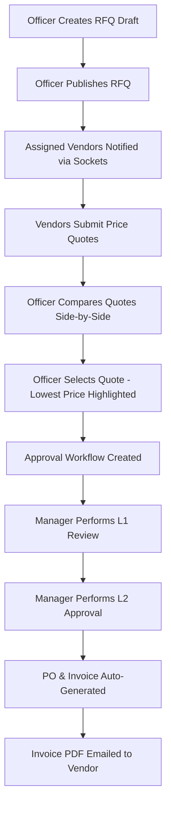

# VendorBridge — Procurement & Vendor Management ERP

VendorBridge is a complete, production-grade Procurement & Vendor Management ERP built for the Odoo Hackathon. It streamlines organizational procurement, vendor registration, RFQ cycles, quotations comparison, multi-stage manager approvals, and automated Purchase Order & Tax Invoice generation.

## 🚀 Tech Stack

- **Frontend**: React 18 + Vite + Redux Toolkit + React Router v6 + Axios + Recharts + ImageKit + Socket.io-client
- **Backend**: Node.js + Express + MongoDB + Mongoose + Redis + Socket.io + PDFKit + Nodemailer + Google Gemini & LangChain

---

## 🛠️ Installation & Setup

### Prerequisites
- Node.js (v18+)
- MongoDB Atlas account (or Mongo URI)
- Redis Cloud instance
- ImageKit account (for logo and specs attachments)
- Google Gemini API Key (for the AI procurement assistant)

### 1. Clone & Environment Configuration
Create a `.env` file inside `/Backend` containing the following environment keys:
```env
MONGO_URI=mongodb+srv://...
JWT=your_jwt_secret
BREVO_API_KEY=your_brevo_or_smtp_key
GOOGLE_EMAIL=your_email@gmail.com
REDIS_HOST=your_redis_host
REDIS_PORT=your_redis_port
REDIS_PASSWORD=your_redis_password
IMAGEKIT_PRIVATE_KEY=your_imagekit_private_key
GOOGLE_GEMINI_API=your_gemini_api_key
NODE_ENVIRONMENT=development
```

### 2. Start Backend Server
```bash
cd Backend
npm install
npm run dev
```
The backend will launch on `http://localhost:5000`.

### 3. Start Frontend Client
Create a `.env` file inside `/frontend`:
```env
VITE_API_URL=http://localhost:5000/api
VITE_IK_PUBLIC_KEY=your_imagekit_public_key
VITE_IK_URL_ENDPOINT=https://ik.imagekit.io/your_endpoint
```
Run the Vite development server:
```bash
cd frontend
npm install
npm run dev
```
The frontend will launch on `http://localhost:5173`.

---

## 🔒 User Roles & Permissions

1. **Procurement Officer**:
   - Register and manage vendors.
   - Create, edit, and publish RFQs.
   - Compare vendor quotations side-by-side.
   - Select the best bid to initiate manager approvals.
   - Track Purchase Orders and mark them as delivered.
2. **Procurement Manager**:
   - Perform L1 & L2 review actions.
   - Approve or reject quotation contracts with remarks.
   - Auto-issue POs and Invoices upon final approval.
3. **Vendor Partner**:
   - View assigned published RFQs.
   - Submit and edit itemized price quotations.
   - Upload specs and track invoices.
4. **Administrator**:
   - Superuser access to override approvals, track logs, and verify partners.

---

## 📊 Core ERP Procurement Pipeline


