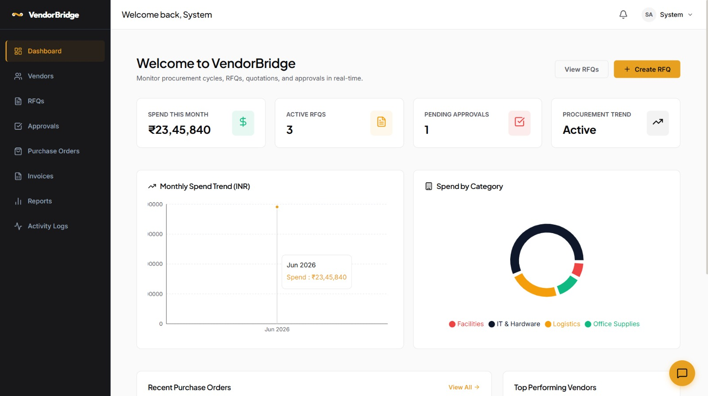
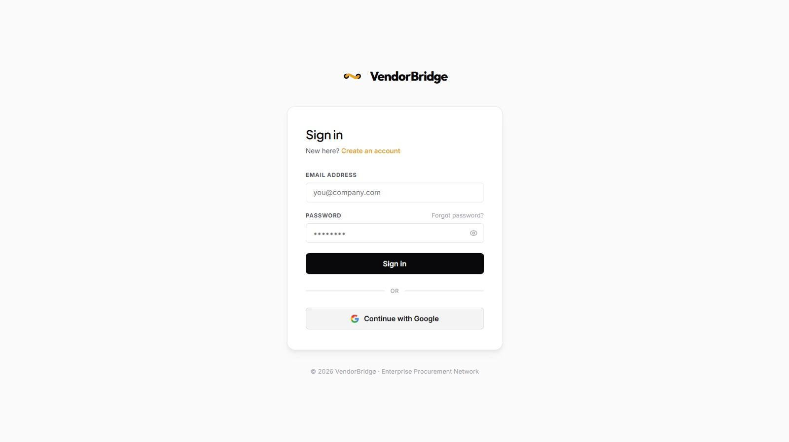
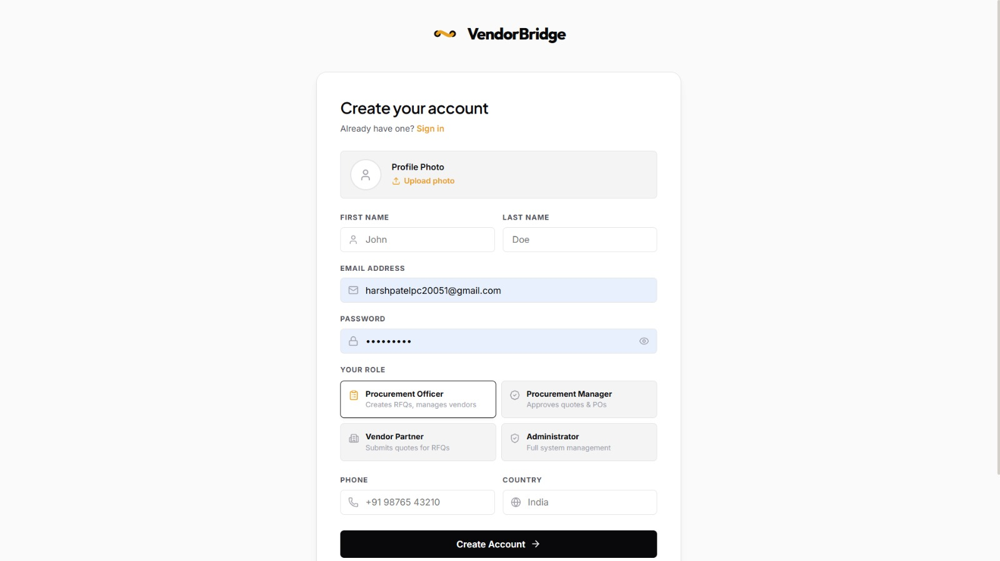
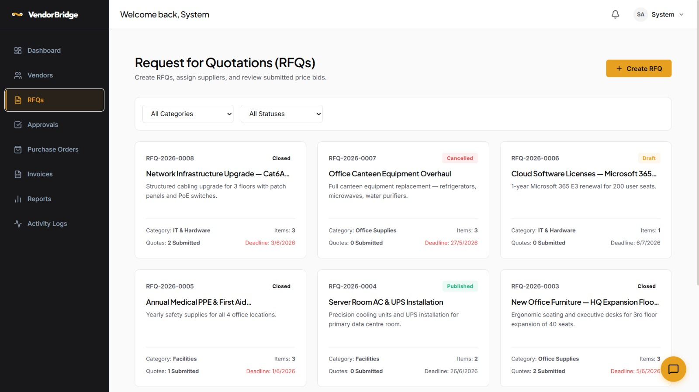
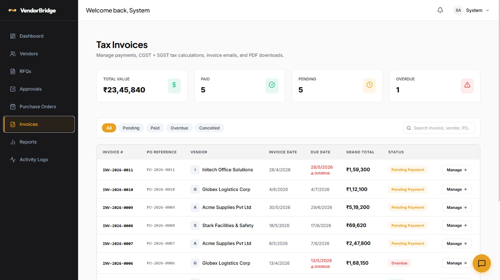
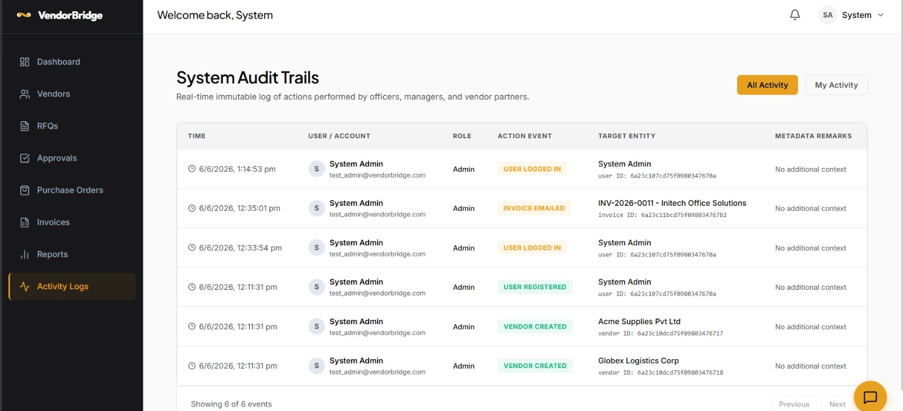

<h1 align="center">
  
  <br/><br/>
  🔗 VendorBridge ERP
</h1>

<p align="center">
  <strong>A full-stack, production-grade Procurement & Vendor Management ERP</strong><br/>
  Built for real-world B2B workflows · AI-powered · Real-time · Fully responsive
</p>

<p align="center">
  <a href="https://odoo-vendorbridge.onrender.com" target="_blank">
    
  </a>
</p>

<p align="center">
  
  
  
  
  
  
  
  
  
  
</p>

---

## 📸 Screenshots

| Login | Sign Up |
|-------|---------|
|  |  |

| Dashboard | RFQs |
|-----------|------|
|  |  |

| Invoices | Activity Logs |
|----------|---------------|
|  |  |

---

## 🧠 What Is VendorBridge?

VendorBridge is a **production-ready, multi-role ERP system** designed to digitize and automate the entire B2B procurement lifecycle — from raising an RFQ to vendor bidding, multi-level approval workflows, auto-generating Purchase Orders & Tax Invoices, and real-time notifications.

This isn't a CRUD app. It's a system with:
- **Role-based access control** (Admin → Manager → Officer → Vendor)
- **Real-time notifications** via Socket.IO with private user rooms
- **AI Procurement Assistant** powered by Gemini 2.5 Flash + LangChain with streaming SSE
- **Redis-backed** rate limiting & response caching
- **Dual-auth flows** — OTP email verification + Google OAuth 2.0
- **Auto PDF generation** with ImageKit CDN upload + Brevo email delivery
- **MongoDB aggregation pipelines** for multi-dimensional analytics

---

## 🏗️ Architecture

```
┌──────────────────────────────────────────────────────────────────┐
│                        CLIENT (React 19 + Vite)                  │
│   Redux Toolkit · React Router v7 · Recharts · Socket.IO Client  │
│   React Hook Form + Zod · ImagKit React · Lucide Icons           │
└─────────────────────────┬────────────────────────────────────────┘
                          │ HTTPS / WSS
┌─────────────────────────▼────────────────────────────────────────┐
│                    SERVER (Express 5 + Node.js ESM)              │
│                                                                  │
│  ┌─────────────┐  ┌──────────────┐  ┌───────────────────────┐   │
│  │  REST APIs  │  │  Socket.IO   │  │  SSE Stream (AI Chat) │   │
│  │  11 routers │  │  Real-time   │  │  LangChain + Gemini   │   │
│  └──────┬──────┘  └──────┬───────┘  └───────────────────────┘   │
│         │                │                                        │
│  ┌──────▼────────────────▼──────────────────────────────────┐    │
│  │              Middleware Pipeline                          │    │
│  │  Helmet · CORS · Rate Limiter (Redis) · JWT verifyToken  │    │
│  │  Role Guard (allowRoles) · Multer · express-validator    │    │
│  └──────┬────────────────────────────────────────────────────┘   │
└─────────│────────────────────────────────────────────────────────┘
          │
┌─────────▼──────────────────────────────────────────────────────────┐
│                        Data / Services Layer                        │
│                                                                     │
│   MongoDB Atlas (Mongoose ODM)     Redis (Upstash / self-hosted)    │
│   ├─ 9 Schemas with indexes        ├─ Rate limiting (100 req/min)   │
│   ├─ Aggregation Pipelines         ├─ Dashboard cache (5 min TTL)   │
│   └─ Pre-save hooks (auto IDs)     ├─ Analytics cache (15 min TTL)  │
│                                    └─ AI chat history (24h TTL)     │
│   ImageKit CDN                     Brevo SMTP                       │
│   ├─ Vendor logos                  ├─ OTP verification emails        │
│   ├─ RFQ attachments               ├─ Password reset emails          │
│   └─ Invoice PDFs                  └─ Invoice PDF email delivery     │
└─────────────────────────────────────────────────────────────────────┘
```

---

## ⚙️ Tech Stack — Choices & Reasoning

| Layer | Technology | Why This? |
|-------|-----------|-----------|
| **Frontend** | React 19 + Vite 8 | Concurrent rendering, fast HMR, ESM-native |
| **State Mgmt** | Redux Toolkit | Predictable global state for auth + notifications |
| **Forms** | React Hook Form + Zod | Zero-rerender perf + schema-driven type-safe validation |
| **Charts** | Recharts | Composable, responsive charting; Recharts' `ResponsiveContainer` prevents infinite resize loops |
| **Backend** | Express 5 (ESM) | Native ES modules, async error propagation, cleaner middleware |
| **Database** | MongoDB + Mongoose | Flexible document model ideal for nested procurement data (line items, steps, etc.) |
| **Cache / Rate Limit** | Redis (ioredis) | Sub-millisecond reads; sliding window rate limiting without DB hits |
| **Real-time** | Socket.IO | Private user rooms (`user:<id>`) for targeted push notifications |
| **AI / Chat** | LangChain + Gemini 2.5 Flash | Streaming SSE from Gemini, chat history preserved in Redis (last 20 turns, 24h TTL) |
| **Auth** | JWT (15m) + Refresh (7d) + Passport Google | Short-lived access tokens in httpOnly cookies; Google OAuth for frictionless SSO |
| **Email** | Brevo API + Nodemailer fallback | Brevo API key detected by `xkeysib-` prefix; falls back to SMTP transporter transparently |
| **Media CDN** | ImageKit | CDN delivery for logos & PDFs; fallback to local buffer if upload fails |
| **Security** | Helmet.js | Sets 14+ HTTP security headers (HSTS, X-Frame-Options, XSS filter, etc.) in one middleware call |
| **PDF** | PDFKit | Server-side, stream-based A4 Tax Invoice generation with GST breakdowns |
| **Logging** | Winston + Morgan | Structured server logs; HTTP access logs in dev mode |

---

## 🔐 Security Architecture

### 1. HTTP Security Headers — `helmet()`
```js
app.use(helmet({
  contentSecurityPolicy: false, // Disabled to allow CDN assets
}));
// Sets: X-DNS-Prefetch-Control, X-Frame-Options, Strict-Transport-Security,
//       X-Content-Type-Options, X-XSS-Protection, Referrer-Policy, etc.
```

### 2. Redis-Backed Rate Limiting (Custom Middleware)
```js
// middleware/rateLimiter.js
// Strategy: sliding window counter with INCR + EXPIRE atomic ops
const hits = await redis.incr(key);           // atomic increment
if (hits === 1) await redis.expire(key, 60);  // set TTL only on first hit
if (hits > 100) return 429 + Retry-After header;
// Fail-open: if Redis is down, request passes through (graceful degradation)
```

### 3. JWT Auth — Dual-Token Pattern
- **Access Token**: 15-minute expiry, stored in `httpOnly` cookie (XSS-safe)
- **Refresh Token**: 7-day expiry, separate cookie
- Both verified with `jsonwebtoken` + signature validation
- Middleware checks `req.cookies.accessToken` then falls back to `Authorization: Bearer` header

### 4. Role-Based Access Control
```
Admin   → Full access to all resources
Manager → Approve/reject L2, view all data
Officer → Create RFQs/Approvals, view own requests
Vendor  → See assigned RFQs, submit bids, view own POs & Invoices
```
```js
// Declarative route protection
router.post('/rfqs', verifyJWT, allowRoles('admin', 'manager', 'officer'), createRFQ);
router.post('/approvals/:id/action', verifyJWT, allowRoles('admin', 'manager'), processApprovalAction);
```

### 5. Google OAuth 2.0 (Passport.js)
- Account linking: if email exists → attach `googleId` to existing account
- New Google users → auto-created with `isVerified: true`, bypassing OTP flow
- `isNew` flag passed to frontend for conditional onboarding redirect

---

## ⚡ Real-Time Architecture — Socket.IO

```
Client connects → socket.emit('join', userId)
                → server: socket.join(`user:${userId}`)

Server event    → io.to(`user:${userId}`).emit('notification', data)
                → Only that user receives it (private room, not broadcast)
```

**Triggered on:**
- L1/L2 approval actions → notify initiator + relevant managers
- Final approval → notify officer (PO issued) + vendor (invoice generated)
- Invoice generation + email delivery confirmation

---

## 🤖 AI Procurement Assistant — ZErio (LangChain + Gemini)

```
User Message
     │
     ▼
Redis: GET chat:{sessionId}          ← Load last 20 message history
     │
     ▼
Build messages: [SystemPrompt, ...history, HumanMessage]
     │
     ▼
LangChain ChatGoogleGenerativeAI     ← model.stream() → async generator
     │
     ▼
SSE chunks: res.write(`data: ${JSON.stringify({text})}\\n\\n`)
     │
     ▼
Redis: SET chat:{sessionId} EX 86400 ← Save updated history (24h TTL)
```

**Edge Cases Handled:**
- Redis down → history ignored, fresh context used (fail-open)
- Gemini stream error → graceful SSE error chunk sent, connection closed cleanly
- History pruned to last 20 messages to prevent token overflow

---

## 📊 MongoDB Aggregation Pipelines

Reports endpoint runs 3 parallel aggregations:

```js
// 1. Spend by Category (6-month window)
PurchaseOrder.aggregate([
  { $match: { status: { $ne: 'cancelled' }, createdAt: { $gte: sixMonthsAgo } } },
  { $lookup: { from: 'vendors', ... } },
  { $group: { _id: '$vendorDetails.category', totalSpend: { $sum: '$grandTotal' } } },
  { $sort: { totalSpend: -1 } }
])

// 2. Monthly Invoice Trend (rolling 6 months)
Invoice.aggregate([
  { $group: { _id: { month: { $month: '$createdAt' }, year: { $year: '$createdAt' } }, total: { $sum: '$grandTotal' } } },
  { $sort: { '_id.year': 1, '_id.month': 1 } }
])

// 3. Top 5 Vendors by Spend
PurchaseOrder.aggregate([
  { $group: { _id: '$vendor', totalSpend: { $sum: '$grandTotal' }, poCount: { $sum: 1 } } },
  { $sort: { totalSpend: -1 } }, { $limit: 5 },
  { $lookup: { from: 'vendors', ... } }
])
```

**Redis cache TTLs:**
- Dashboard stats → 5 minutes (`EX 300`)
- Analytics reports → 15 minutes (`EX 900`)
- Cache key includes `userId` for role-specific dashboard data

---

## 📄 Auto Invoice Pipeline (On Final L2 Approval)

```
L2 Approver clicks "Approve"
         │
         ▼
1. Create PurchaseOrder (auto PO number: PO-YYYY-NNNN)
         │
2. Calculate GST: CGST 9% + SGST 9% on subtotal
         │
3. Generate Tax Invoice PDF (PDFKit, A4)
         │
4. Upload PDF → ImageKit CDN (/invoices/ folder)
         │                          ↓ (if upload fails)
         │                    Fallback: keep raw Buffer
         │
5. Save Invoice doc with pdfUrl + pdfFileId
         │
6. Email PDF to Vendor via Brevo API (attachment as base64)
         │
7. Emit Socket.IO events → Officer (PO issued) + Vendor (invoice)
         │
8. Write ActivityLog entry with poId + invoiceId metadata
```

---

## 📁 Project Structure

```
VendorBridge/
├── Backend/
│   ├── config/
│   │   ├── index.js          # Centralized env config (dotenv + validation)
│   │   ├── db.js             # Mongoose connection
│   │   ├── redis.js          # ioredis client (URL or host/port)
│   │   ├── socket.js         # Socket.IO server init + emitToUser helper
│   │   └── imagekit.js       # ImageKit SDK init
│   ├── controllers/          # 11 controllers (auth, vendor, rfq, quotation,
│   │                         #   approval, po, invoice, report, activity, upload, chat)
│   ├── middleware/
│   │   ├── auth.js           # verifyJWT + allowRoles RBAC guard
│   │   ├── rateLimiter.js    # Redis sliding-window rate limiter
│   │   ├── errorHandler.js   # Global async error handler
│   │   ├── upload.js         # Multer config (memory storage)
│   │   └── validate.js       # express-validator result checker
│   ├── models/               # 9 Mongoose schemas (User, Vendor, RFQ, Quotation,
│   │                         #   Approval, PurchaseOrder, Invoice, Notification, ActivityLog)
│   ├── routes/               # 11 Express routers
│   ├── services/
│   │   ├── chatService.js    # LangChain + Gemini SSE streaming
│   │   ├── emailService.js   # Brevo API + Nodemailer fallback
│   │   ├── pdfService.js     # PDFKit invoice generation + ImageKit upload
│   │   ├── notificationService.js  # DB notification + Socket.IO emit
│   │   ├── otpService.js     # 6-digit OTP generation + Redis TTL storage
│   │   ├── authService.js    # JWT token generation helpers
│   │   └── mediaService.js   # ImageKit file deletion
│   ├── utils/
│   │   ├── ApiError.js       # Standardized error class
│   │   ├── ApiResponse.js    # Standardized success response wrapper
│   │   └── asyncHandler.js   # Express async error boundary
│   └── server.js             # App entry: middleware chain, routes, SPA fallback
│
├── frontend/
│   ├── public/
│   │   └── favicon.svg       # Custom VendorBridge logo SVG
│   └── src/
│       ├── components/
│       │   ├── layout/       # AppLayout, Sidebar, Topbar
│       │   ├── common/       # Card, Table, Modal, Badge
│       │   └── chat/         # ChatPanel (SSE streaming consumer)
│       ├── pages/            # Dashboard, Vendors, RFQs, Approvals,
│       │                     # PurchaseOrders, Invoices, Reports, Activity
│       │   └── auth/         # Login, Register, ForgotPassword, AuthCallback
│       ├── services/
│       │   └── api.js        # Axios instance with interceptors
│       ├── store/            # Redux Toolkit slices (auth, notification)
│       └── main.jsx
│
└── Screenshot/               # App screenshots
```

---

## 🔑 Key Features

### For Internal Teams (Admin / Manager / Officer)
| Feature | Details |
|---------|---------|
| 📋 **RFQ Management** | Create, publish, assign vendors; auto-numbering `RFQ-YYYY-NNNN` |
| 🏢 **Vendor Registry** | Full vendor profiles with logo upload (ImageKit), GSTIN, ratings, spend tracking |
| ✅ **2-Level Approval Workflow** | L1 (Officer/Manager review) → L2 (Manager/Admin final) → Auto PO + Invoice |
| 📊 **Analytics Dashboard** | Live Recharts: spend trends (6mo), category breakdown (pie), top vendors |
| 📄 **CSV Export** | One-click procurement data export with full PO details |
| 🔔 **Real-time Notifications** | Socket.IO push for every workflow state change |
| 📝 **Activity Logs** | Immutable audit trail for every critical action |

### For Vendors
| Feature | Details |
|---------|---------|
| 📬 **RFQ Bidding** | View assigned RFQs, submit/edit price quotations with GST, delivery, payment terms |
| 📦 **PO Tracking** | View issued purchase orders in real-time |
| 🧾 **Invoice Management** | Download PDF tax invoices; receive via email automatically |
| 🤖 **AI Assistant** | 24/7 ZErio AI bot for procurement queries, with persistent chat history |

---

## 🛡️ Edge Cases Handled

| Scenario | Handling |
|----------|---------|
| Redis connection failure | Fail-open: rate limiter passes request; chat uses empty history |
| ImageKit upload failure | Graceful fallback: PDF buffer kept in memory, URL set to null |
| Brevo API error | Caught, logged, invoice still saved; email failure doesn't break PO creation |
| Google account linking | `$or: [{googleId}, {email}]` query prevents duplicate accounts |
| Concurrent approval actions | Mongoose `findById` + immediate status check prevents double-processing |
| Socket.IO user not connected | `emitToUser` silently no-ops if user has no active socket |
| OTP expiry | 5-minute TTL in Redis; expired = 400 error with clear message |
| Gemini stream timeout | try/catch around `for await` loop; SSE error chunk sent before close |
| Inactive user account | `user.isActive` check in JWT middleware → 403 Forbidden |
| Role escalation attempt | `allowRoles(...roles)` middleware on every protected route |

---

## 🔄 Auth Flow

```
Email/Password Flow:
  Register → OTP email (Brevo) → Verify OTP → JWT issued in httpOnly cookie

Google OAuth Flow:
  Login with Google → Passport GoogleStrategy → Find or Create user
  → isNew flag → Redirect to /auth/callback?token=... → Frontend extracts token

Token Refresh:
  Access Token (15m) expires → Client calls /api/auth/refresh
  → Refresh Token (7d) verified → New Access Token issued
```

---

## 📡 API Overview

```
POST   /api/auth/register          Register + OTP send
POST   /api/auth/verify-otp        Verify OTP → issue tokens
POST   /api/auth/login             Email/Password login
POST   /api/auth/refresh           Refresh access token
GET    /api/auth/google            Google OAuth initiate
GET    /api/auth/google/callback   Google OAuth callback

GET    /api/vendors                List vendors (cached)
POST   /api/vendors                Create vendor
PUT    /api/vendors/:id            Update vendor
DELETE /api/vendors/:id            Delete vendor

GET    /api/rfqs                   List RFQs (role-filtered)
POST   /api/rfqs                   Create RFQ
PUT    /api/rfqs/:id/publish       Publish RFQ to vendors
POST   /api/rfqs/:id/assign        Assign vendors to RFQ

POST   /api/quotations             Submit vendor bid
GET    /api/quotations/rfq/:rfqId  Get bids for an RFQ

POST   /api/approvals              Initiate approval workflow
GET    /api/approvals              List approvals (role-filtered)
POST   /api/approvals/:id/action   L1/L2 approve or reject

GET    /api/purchase-orders        List POs
GET    /api/invoices               List invoices
GET    /api/invoices/:id/pdf       Stream invoice PDF

GET    /api/reports/dashboard      Dashboard stats (Redis cached, role-aware)
GET    /api/reports/analytics      Aggregation pipeline analytics (Redis cached)
GET    /api/reports/export         CSV export of all POs

POST   /api/chat/stream            SSE streaming AI chat (LangChain + Gemini)
GET    /api/activity               Activity log feed

POST   /api/upload/image           Upload image to ImageKit
```

---

## 🌐 Environment Variables

Create `Backend/.env`:

```env
# App
PORT=3000
NODE_ENV=production
CLIENT_URL=https://your-frontend-domain.com

# MongoDB
MONGO_URI=mongodb+srv://<user>:<pass>@cluster.mongodb.net/vendorbridge

# Redis (Upstash or self-hosted)
REDIS_URL=rediss://:<password>@<host>:6379
# OR use host/port/password separately
REDIS_HOST=127.0.0.1
REDIS_PORT=6379
REDIS_PASSWORD=

# JWT
JWT_SECRET=your_super_secret_min_32_chars
JWT_REFRESH_SECRET=your_refresh_secret_min_32_chars

# Google OAuth
GOOGLE_CLIENT_ID=xxxxx.apps.googleusercontent.com
GOOGLE_CLIENT_SECRET=GOCSPX-xxxxx
GOOGLE_CALLBACK_URL=https://your-backend.com/api/auth/google/callback

# ImageKit
IK_PUBLIC_KEY=public_xxxxx
IK_PRIVATE_KEY=private_xxxxx
IK_URL_ENDPOINT=https://ik.imagekit.io/your_id

# Gemini AI
GEMINI_API_KEY=AIzaSy-xxxxx

# Brevo (Transactional Email)
SMTP_HOST=smtp-relay.brevo.com
SMTP_PORT=587
SMTP_USER=your@email.com
SMTP_PASS=xkeysib-xxxxxxxx   # Brevo API key (detected by prefix)
SMTP_FROM="VendorBridge" <noreply@yourdomain.com>
```

---

## 🚀 Deployment

The app is deployed as a **monorepo on [Render](https://render.com)**:

- **Backend** serves as the primary web service
- **Frontend** is pre-built (`vite build`) and served as static files from `frontend/dist/` by Express
- SPA routing handled by Express wildcard: `app.get(/.*/, ...)` → `index.html`
- All env vars configured in Render dashboard

**Live URL:** [https://odoo-vendorbridge.onrender.com](https://odoo-vendorbridge.onrender.com)

> ℹ️ Free tier spins down after 50s of inactivity — first request after idle may take ~10-15s to cold-start (this is Render's free tier behavior, not the app).

---

## 🧩 Data Models (Mongoose Schemas)

| Model | Key Fields |
|-------|-----------|
| `User` | email, passwordHash, role, isVerified, isActive, googleId, refreshToken |
| `Vendor` | companyName, gstNumber, category, linkedUser, rating, totalOrders, totalSpend, logo |
| `RFQ` | rfqNumber (auto), title, lineItems[], assignedVendors[], status, attachments[] |
| `Quotation` | rfq, vendor, items[], subtotal, gstPercent, grandTotal, deliveryDays, status |
| `Approval` | rfq, vendor, quotation, steps[{label, approver, status, remarks}], currentStep, overallStatus |
| `PurchaseOrder` | poNumber (auto), rfq, vendor, lineItems[], subtotal, cgstAmount, sgstAmount, grandTotal, deliveryDate |
| `Invoice` | invoiceNumber (auto), po, vendor, lineItems[], cgst, sgst, grandTotal, pdfUrl, sentAt |
| `Notification` | user, title, message, type, link, isRead |
| `ActivityLog` | action, entity, entityId, entityTitle, performedBy, meta{} |

All schemas use **compound indexes** for query performance:
```js
rfqSchema.index({ status: 1, createdBy: 1, deadline: 1 });
```

---

## 👥 Role Access Matrix

| Action | Admin | Manager | Officer | Vendor |
|--------|:-----:|:-------:|:-------:|:------:|
| Create RFQ | ✅ | ✅ | ✅ | ❌ |
| Publish RFQ / Assign Vendors | ✅ | ✅ | ✅ | ❌ |
| Submit Quotation | ❌ | ❌ | ❌ | ✅ |
| Initiate Approval | ✅ | ✅ | ✅ | ❌ |
| L1 Approve/Reject | ✅ | ✅ | ❌ | ❌ |
| L2 Final Approve/Reject | ✅ | ✅ | ❌ | ❌ |
| View All Approvals | ✅ | ✅ | Own only | ❌ |
| View All POs / Invoices | ✅ | ✅ | ✅ | Own only |
| Download Invoice PDF | ✅ | ✅ | ✅ | ✅ |
| View Analytics | ✅ | ✅ | ✅ | ❌ |
| Manage Vendors | ✅ | ✅ | ❌ | ❌ |
| AI Chat (ZErio) | ✅ | ✅ | ✅ | ✅ |

---

## 🎯 What Makes This Different

> Most procurement tools are either too simple (basic CRUD) or too complex (SAP/Oracle). VendorBridge hits the sweet spot.

1. **End-to-end automation** — One final approval click triggers: PO creation → GST calculation → PDF generation → CDN upload → Email delivery → Real-time notification. Zero manual steps.

2. **Production security posture** — Helmet headers + Redis rate limiting + JWT in httpOnly cookies + role guards on every route. Not an afterthought.

3. **AI with memory** — The ZErio chat assistant maintains full conversation history per session (Redis, 24h TTL, last 20 turns) and streams tokens progressively. It knows your platform context from a rich system prompt.

4. **Resilient by design** — Every external service (Redis, ImageKit, Brevo, Gemini) has explicit error handling with graceful fallbacks. The system degrades gracefully, never hard-crashes.

5. **Multi-role, not multi-tenant** — The same app serves procurement officers, finance managers, and external vendors with completely different views and permissions on the same data.

---

## 🛠️ Built With

| | Tool |
|--|------|
| **Frontend** | React 19, Vite 8, Redux Toolkit, React Router v7, Recharts, Zod, React Hook Form, Socket.IO Client, Lucide React, React Hot Toast, date-fns, imagekitio-react |
| **Backend** | Node.js (ESM), Express 5, Mongoose, ioredis, Socket.IO, Passport.js, LangChain, @langchain/google-genai, PDFKit, Multer, nodemailer, bcryptjs, jsonwebtoken, helmet, morgan, winston, express-rate-limit, express-validator, uuid |
| **Infrastructure** | MongoDB Atlas, Redis (Upstash), ImageKit CDN, Brevo Transactional Email, Render (hosting) |

---

<p align="center">
  Made with ⚡ by Team VendorBridge
</p>
